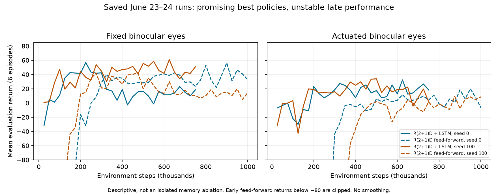

# ACI research review and student handoff — 2026-09-10

> The reviewed working code has been promoted to `main`. Students should start with the [quickstart](../student_quickstart.md). The branch table below is a historical snapshot; the previous `main` is preserved at `legacy-main-v0.0.0`.

## Follow-up: code prepared for commit

After the initial review, the user requested committing and pushing the necessary code. The snapshot below describes the pre-commit state at `0136459`; its references to uncommitted files and the analyzer crash are historical findings.

The follow-up fixes the analyzer timestep lookup, documents its single seeded RNG stream, corrects the best-checkpoint metadata path, and preserves each metabolism condition's overlays/body/seed during posthoc analysis. It versions the pending diagnostic wrapper, analysis package, experimental metabolism implementation, configs/assets, and launchers. Local transfer patches and the recursive-info backup remain on disk and are ignored by Git. The cost formula and scientific experiment settings are retained, with the command-cost limitation clarified in the source.

Validation after these fixes: **20 tests passed**; shell syntax and diff-whitespace checks passed; the repaired analyzer loaded the saved seed-0 actuated recurrent checkpoint and completed two full 256-step episodes, writing CSV, JSON, and plots under `/tmp/aci_commit_validation/behavior`. That is an integration check, not validation of the fixation/saccade metric definitions or a metabolism training result. The original review evidence remains unchanged; a follow-up validation entry records the repair.

## Assessment

The best continuation point is `feature/shared-r2plus1d-retina` at `0136459`, plus a separately reviewed set of uncommitted June 24 changes. The latest committed architecture learns useful policies with independently actuated binocular eyes in two recorded seeds. It is a promising research baseline, not yet a demonstrated minimal mechanism for saccades and fixations, and not a reliably converged policy across seeds.

The last recorded development sequence was: improve body steering; add a shared spatiotemporal retina; add motor-conditioned binocular fusion and persistent recurrent state; then attempt behavior analysis and body/eye metabolism. That final sweep crashed before checkpoints. The working directory includes a subsequent wrapper repair and a small completed smoke run, but no completed metabolism rerun.

This review inspected Git history and the live remote branch list, current source, saved configurations, evaluation arrays, launch errors, checkpoints through the existing audit, and regression tests. Evidence coverage: **51 local run directories, 50 saved configs, 44 evaluation arrays, 39 `finished` markers, and 60 launch logs**. A finished marker includes early-stopped and smoke runs; it does not mean that the requested training budget was reached or that the task was solved. Historical June 9–19 outcomes below come from committed notes unless stated otherwise; those original run directories are absent from this checkout.

The student's central question should be: **under a fixed task and sensing process, what is the smallest policy and cost structure that yields reproducible gaze stabilization interrupted by rapid gaze shifts while preserving task performance?** Acquiring targets with movable eyes is a prerequisite, not the answer.

## Branch map

The remote was checked with `git ls-remote --heads origin` on the review date. No branches were switched, merged, deleted, or pushed.

| Branch | Location | Tip | Meaning and disposition |
|---|---|---|---|
| `main` | local + remote | `69525c7`, Dec 1, 2025 | Older ACI fork baseline, already including noise/integration work; not a pristine upstream release. Keep as historical reference. |
| `saccade-and-fixate-agents` | remote | `a233723`, Jun 17 | Early movable-eye, single-eye diagnostics, goal-only PPO recipes, binocular diagnostics and CoordCNN tooling. Historical. |
| `codex/binocular-actuated-ppo` | remote | `a233723`, Jun 17 | Exact same commit as the preceding branch, not a separate implementation. |
| `codex/r2dreamer-frozen2` | remote | `e62a749`, Jun 19 | Adds external R2-Dreamer integration; despite its name, its tip supports actuated eyes and gaze analysis. Keep as a historical comparison. |
| `cleanup/binocular-tracking-baseline` | local only | `cbe5019`, Jun 23 | Contains June 22 audit/repairs, explicit baseline launchers, then relative-heading and reward variants. Ancestor of current work. |
| `fix/yaw-rate-body-controller` | local only | `b900ab3`, Jun 23 | Physical yaw-rate control instead of absolute/relative heading targets. Ancestor of current work. |
| `feature/shared-r2plus1d-retina` | local + remote; active | `0136459`, Jun 24 | Shared R(2+1)D visual encoder, cyclopean fusion, custom LSTM PPO. Recommended continuation point. |
| `square-trout` | local linked worktree | `0136459` | Same tip as active branch. Worktree: `/home/jake/intent/workspaces/sweet-cheetah/aci`. Its separate working tree was not audited here. |

There are five remote branch names and five local names; two names are shared between the lists. The substantive tips lie on one ancestry chain:

```text
main 69525c7
  -> early PPO a233723 [two remote names]
  -> Dreamer e62a749
  -> audited cleanup 6e6b9bf
  -> relative-heading cbe5019
  -> yaw-rate b900ab3
  -> shared retina + cyclopean LSTM 0136459 [two local names]
```

Ancestry does not mean all old tools remain available: the cleanup deleted most one-off launchers and the Dreamer runner from the active tree. Recover them from the historical branch/commit. The June 22 audit mentions a checksummed legacy archive, but no such archive was found in the current tree or its cleanup commit; `share/` is empty. Git history does retain the inspected historical scripts and documents.

The June 22 warning about corrupt Git metadata is historical. Current `git fsck --full --no-reflogs` exits successfully, reporting dangling objects rather than corrupt objects or invalid refs. A fresh clone is still useful for reproducibility, but corruption is not a demonstrated current blocker.

## What was tried

| Period / experiment family | Evidence and outcome | Interpretation |
|---|---|---|
| 2025 sensor noise and integration | Commits on/near `main`; later audit identified motion-dependent integration. | Exploratory sensor manipulation. The old motion-dependent rule confounded a clean slow-sensor hypothesis. |
| Jun 9–10 single movable/frozen eye | Early pan/tilt implementation; historical single-eye notes report frozen 105° 35×35 run peaking around +5 then falling to −6; 64×64 peaked around +5 and ended near zero. | Longer training, extra pixels, and disabling early stop did not rescue those particular conditions. Not proof that monocular vision is inherently insufficient. |
| Single-eye diagnostic ablations | Historical confusion/motion analysis; goal-only ablation reached a +21 peak and +6.8 final; two-eye overlap experiment was still running in the June 10 handoff. | Evidence for parking, discrimination difficulty, and task dependence. The notes' causal claim that parallax explains three-eye success is stronger than the controlled evidence. No final June 10 binocular outcome recovered. |
| Jun 13 visible-offset goal-only PPO | Historical notes report six seeds each for fixed eyes and narrow-range actuated eyes reaching 6/6 success, using stop-on-success. Wide eye ranges failed one recorded seed. | A successful simplified acquisition task. Does not establish moving-target plus adversary tracking or stable late-training performance. |
| PPO optimization changes | Lower learning rate/clip/epochs, entropy/KL/gradient variants still flipped between success and failure in historical notes. | Checkpoint selection helped preserve transient success; optimizer tuning alone did not remove instability. |
| Jun 13–16 goal-only recipe exploration | Scripts cover ground texture, contact termination, fixed speed, relative steering, dense progress/facing/turn rewards, target respawn, stationary/visible/moving targets, small versus spatial CNN, wide/matched FOV. | Existence of a launcher is implementation evidence, not proof that every variant completed. Full historical file inventory is included. |
| Matched binocular moving-target PPO | Historical notes explicitly retract some successes: wrong physical FOV/coverage, and a high-return corrected run with stationary fractions 0.85–0.998. | Several apparent successes were geometry or evaluation false positives. |
| CoordCNN / proposed GRU | CoordCNN code/config remains; June 17 spec proposes a GRU and behavior gates. | Do not label the proposed CoordCNN-GRU system validated. Current recurrence is a different custom LSTM. |
| Jun 17–19 R2-Dreamer | Runner uses external `NM512/r2dreamer`; initial documented 10k CPU pilot had zero captures. Jun 19 adds actuated-eye runs and gaze analysis; June 22 audit describes pursuit in later video. | Consistent with the user's recollection of useful Dreamer pursuit, but later task was goal-only with shaping/respawn. No local later Dreamer arrays or timing results to establish robustness or fair speed comparison. |
| Jun 22 audited baseline ladder | Actual local completed three-eye MLP, fixed binocular MLP, fixed binocular spatial-CNN recurrent PPO, and actuated recurrent PPO runs. | Task/geometry and observation bugs repaired. Three-eye control learns; fixed binocular recurrence helps; initial actuated recurrence remains weak. See results below. |
| Jun 23 actuated MLP seeds 0/100/200/300 | Completed or early-stopped runs; best eval means roughly −0.3, −448.4, −386.6, −398.6. | Strongly brittle/unsuccessful in these conditions. |
| Relative heading ±0.25 and hunger | Seeds 0/100, fixed and actuated; several Hydra composition failures before completed launches. Best means remain roughly 0–4 after successful composition. | Did not establish a reliable tracking baseline. Separate launch failures from failed learning. |
| Physical yaw-rate body control | Fixed/actuated seeds 0/100 at 250k, 750k, 1.5M budgets. Fixed eyes improve substantially at longer budgets; actuated eyes remain weak. | Better body control is useful, but by itself does not solve actuated-eye learning. |
| Shared R(2+1)D retina with feed-forward PPO | Four complete 1M-step runs: fixed/actuated × seeds 0/100. Earlier 125k/200k/225k runs are incomplete. | Fixed eyes learn; actuated result improves in some evaluations but remains unstable. “mlp” in run names does not mean raw-pixel MLP: the encoder override is R(2+1)D. |
| Jun 24 cyclopean LSTM PPO | Four complete 750k runs: fixed/actuated × seeds 0/100. | Best available actuated-eye candidate. Both actuated seeds improve, but late scores fall. |
| Jun 24 metabolism / heavier body | Baseline, idle-only, weak-heavy, strong-heavy at seed 0. All four crash with worker `RecursionError`, followed by broken pipes. Analysis reports missing checkpoints. | No metabolism learning result. The design also changes physics and cost together, so it cannot isolate their effects. |
| Subsequent recursion repair | Uncommitted wrapper snapshot repair; `subproc_info_smoke_20260624_205214` has a finished marker but no eval array. | Plumbing evidence only. Full sweep was not rerun in the available logs. |

Historical source documents can be read without checking out old branches:

```bash
git show a233723:docs/single_eye_investigation.md
git show a233723:docs/ppo_visual_tracking_recipe.md
git show a233723:docs/binocular_actuated_ppo_spec.md
git show e62a749:docs/r2dreamer_frozen2_handoff.md
```

## Quantitative results from local arrays

Numbers below are **mean return per six-episode evaluation block** from `evaluations.npz`: best observed block / last observed block. The last block is not necessarily evaluation of the exact final optimizer state. These are development evaluations, not independent held-out estimates. Budgets, architecture, reward, and body control differ across rows; do not interpret this table as a controlled algorithm ranking.

| Condition | Seed | Requested budget | Best mean | Last mean |
|---|---:|---:|---:|---:|
| Jun 22 original three-eye MLP | 0 | 500k | 50.11 | 34.25 |
| Jun 22 fixed binocular MLP | 0 | 500k | −3.46 | −19.76 |
| Jun 22 fixed binocular spatial recurrent PPO | 0 | 500k | 18.24 | 11.42 |
| Jun 22 actuated binocular spatial recurrent PPO | 0 | 500k | 1.13 | 0.00 |
| Fixed binocular yaw-rate MLP | 0 / 100 | 1.5M | 70.0 / 66.3 | 53.5 / 55.3 |
| Fixed binocular R(2+1)D feed-forward | 0 / 100 | 1M | 56.36 / 42.45 | 32.76 / 14.49 |
| Actuated binocular R(2+1)D feed-forward | 0 / 100 | 1M | 19.90 / 9.25 | −6.54 / 8.49 |
| Fixed binocular cyclopean LSTM | 0 / 100 | 750k | 56.76 / 60.86 | 18.43 / 50.70 |
| Actuated binocular cyclopean LSTM | 0 / 100 | 750k | **32.43 / 33.89** | **18.35 / 1.63** |

The June 24 actuated best checkpoints occur at **625k** steps for seed 0 (`vis_24.mp4`) and **500k** for seed 100 (`vis_19.mp4`). Paths:

- `logs/2026-06-24/actuated-2eye-rppo_cyclopean_lstm_seed0_nenv8_20260624_095910/best_model.zip`
- `logs/2026-06-24/actuated-2eye-rppo_cyclopean_lstm_seed100_nenv8_20260624_095910/best_model.zip`

All four June 24 LSTM runs reach their 750k evaluation in approximately **1.50–1.60 hours** according to their evaluation-monitor elapsed timestamps. This includes evaluation work and reflects the recorded machine/concurrent workload; it is not a portable training-speed promise. There is no comparable local Dreamer timing evidence.

`train_fitness.txt` is **not** the per-episode final or best mean. Its configured fitness function sums groups of evaluation episodes and takes a statistic over the upper part of the training history. For example, the actuated LSTM fitness files contain 152.28 and 176.41, while their best mean evaluation returns are 32.43 and 33.89. Use arrays and explicit metric definitions when reporting performance.



The fixed/actuated R(2+1)D feed-forward and cyclopean runs share the inspected train/eval environment definitions, but the policy comparison changes binocular fusion, conditioning, initialization, PPO settings, and recurrence together. It does not prove that LSTM memory alone caused the gain. A ten-frame stack also provides temporal information even without an LSTM.

## What the current system actually does

- MuJoCo maze with a trainable point agent, moving `goal0`, and moving `adversary0`. Target/adversary differ visually through sphere texture orientation.
- Matched binocular cameras: two 20×30 RGB images, yaw centers ±18.75°, horizontal FOV 67.5°, vertical FOV 45°. Total 1,200 pixels matches three 20×20 eyes.
- Independent eye position servos: left/right pan and tilt, plus body forward speed and physical yaw rate. Policy action has six components. A zero forward command maps to half-speed; stopping requires the negative endpoint.
- Ten-frame retinal history through one shared per-eye R(2+1)D encoder. Each eye retains a 24×4×6 feature map.
- Stacked previous commands, physical eye state, and contact bit condition the visual maps; learned binocular fusion produces a 192-dimensional representation.
- One 128-unit LSTM, with both actor and critic losses training it. Heads receive both the current fused representation and recurrent output through a skip connection.
- PPO uses 256 rollout steps, batch size 256, four epochs, learning rate 2.5e-4; recorded sweeps use eight environments.
- Latest successful sweeps add `tracking_documented_reward` and `textured_ground`. The former adds a training-only progress coefficient of 0.25; evaluation disables that shaping and retains target/adversary/contact scoring. Sensor noise and integration are zero.

The June 22 contract is stale in two ways: it says recurrence has no frame stack, and it disallows progress shaping. Current code deliberately uses the stack; successful runs deliberately use shaping. The original task documentation itself describes the 0.25 progress term. This needs an explicit versioned distinction between the literal no-shaping control and the practical documented-reward baseline, rather than silently treating either as the only valid task.

## Current verification and handoff blockers

1. **Existing regression suite passes:** 17 tests in 7.06 seconds, including retinal layout, recurrent gradients/reset, strict checkpoint loading, contract checks, and the two uncommitted motor-cost tests. This is not a long-training reproduction.
2. **Standard evaluation runs:** the existing evaluator loaded the saved seed-0 actuated best checkpoint on CPU, ran two episodes from evaluation seed 1000 with the documented-reward/texture settings, and wrote an MP4. Episode returns were 0.00 and 2.79 (mean 1.40). This small smoke evaluation proves replay/rendering works, not robust generalization; it is a fresh result separate from the historical best-block scores. Outputs were isolated under `/tmp/aci_review_20260910/standard_eval`.
3. **Physical geometry passes:** the seed-0 actuated LSTM compiled camera check returns `status: ok`. The run-contract audit passes 32 checks and fails only `task.no_added_reward_shaping` for `euclidean_delta_to_goal`. Reports are included. The trainer currently writes the *evaluation* environment XML as `compiled_env.xml`; the filename should not be taken as proof of independently compiled training geometry.
4. **Behavior analyzer fails in an actual invocation:** `cambrian/analysis/tracking_behavior.py:206` accesses `cambrian_env.config`, but `MjCambrianMazeEnv` exposes `_config`, not `config`. A six-episode attempt loaded the checkpoint and built the environment, then crashed before collecting measurements. Existing tests do not cover this path. Also validate episode seeding: the analyzer passes a new seed to every reset, but `MjCambrianEnv.reset` only applies that argument before the first reset. The source was left unchanged for this review.
5. **Gaze metrics are incomplete even after that repair:** current analysis uses horizontal body-yaw + base-yaw + pan and a horizontal-FOV visibility approximation. It omits tilt in gaze speed and does not account for occlusion or recognition. It reports speed distributions/bimodality, not segmented fixations, durations, saccade amplitudes, or target-relative retinal slip. A stationary gaze is not automatically fixation on a moving target.
6. **Energy semantics need correction/clarification:** `reward_fn_motor_metabolism` charges the magnitude of eye *position commands*. Holding an eccentric gaze costs money even with no eye motion; commanding a return to center can cost zero while the eye moves. This is an eccentricity/control-command penalty, not measured movement energy. The “idle” term is a constant per alive step, not a detector of inactivity. Costs apply during evaluation too, so returns across conditions mix task performance and cost.
7. **Important work is uncommitted:** four modified tracked files (`reward_fns.py`, `callbacks.py`, `trainer.py`, `wrappers.py`) plus the analysis package, heavy-body assets/configs, three metabolism overlays, launchers, tests, and patch/backup files. A student cloning the remote will not receive those additions. Do not apply all patch files blindly: some duplicate already committed functionality.
8. **Evaluation reconstruction can drift:** evaluation and analysis scripts choose today's mode configuration rather than restore all saved training overrides. Ground texture, physical body, reward conditions, frame stack, or sensor settings may change. The evaluation launcher defaults its output to the old run directory, and the monitor may overwrite historical evaluation data. Replay into a new directory with explicit saved settings.
9. **Best/final artifacts differ:** `best_model.zip` is an SB3 checkpoint; `policy.pt` contains final policy weights. The uncommitted metadata addition constructs `best_model_zip` from the render/log directory, whereas the sweep saves the checkpoint in the run root; check this path before relying on the new metadata. `latest.mp4` is not necessarily the best policy's video.
10. **Reproducibility remains partial:** logs are ignored by Git, old Dreamer evidence is absent locally, no full environment lock is present, and historical runs do not consistently preserve source patches/versions. Several older commands target deleted classes/configurations. Current `python` is not on PATH, although the `aci312` environment exists.

## Codebase reading map

| Read first | Why |
|---|---|
| `cambrian/main.py`, `cambrian/config.py` | CLI and Hydra composition. |
| `cambrian/configs/task/detection.yaml`, `tracking.yaml` | Training task, rewards, termination, and evaluation differences. |
| `cambrian/configs/example/tracking_2eye_recurrent_{fixed,actuated}.yaml` | Current experiments; follow their defaults. |
| `cambrian/configs/overlay/` | Progress reward, texture, hunger, experimental metabolism. |
| `cambrian/agents/point.py`, `cambrian/models/agents/point_yaw_rate.xml` | Body command semantics and eye actuation. |
| `cambrian/eyes/eye.py`, `multi_eye.py` | Camera construction, sensor noise/integration, binocular geometry. |
| `cambrian/ml/features_extractors.py`, `policies.py` | Shared retina, binocular fusion, recurrent state. |
| `cambrian/ml/model.py`, `trainer.py`, `callbacks.py` | PPO integration, strict loading, vector environments, checkpoints/evaluation. |
| `cambrian/utils/wrappers.py` | Agent selection, observation wrappers, inter-process diagnostics. |
| `cambrian/ml/behavior_audit.py`, `cambrian/analysis/tracking_behavior.py` | Older pursuit/parking diagnostics and unfinished gaze analysis. |
| `scripts/audit_run_contract.py`, `preflight_binocular_geometry.py`, `tests/` | Existing validation surface. |

## Student handoff plan

### First deliverable: one reproducible experiment

Use the current feature branch as the starting point. Preserve existing branch tips; consolidate documentation and entry points before deleting history. Review and commit the pending work in separable changes: wrapper repair; behavior analysis; motor costs/physics. Keep the failed metabolism sweep labeled failed.

Pin the environment and record its installation procedure. This review used Python 3.12.13, Torch 2.6.0+cu124, MuJoCo 3.2.6, SB3/sb3-contrib 2.4.0, NumPy 1.26.4, Hydra core 1.4.0.dev1, hydra-config 0.0.10, pytest 8.3.3. These are the current review environment, not proven historical versions for every run.

Publish one named practical recurrent baseline with its complete configuration: moving target plus adversary, yaw-rate body, matched cameras, stack + encoder + fusion + LSTM, progress shaping only during training, ground texture, no sensor/cost manipulations. Keep the no-shaping version as a separate control. Make the audit mode-aware; do not just disable its failed check globally.

Acceptance: a clean clone can install, pass tests, build/step the environment, load a known best checkpoint, write a video and event log into a fresh output directory, and reproduce a declared evaluation distribution. Store the run's Git SHA/dirty patch, full train and eval configurations, both compiled environments, seeds, versions, checkpoints, evaluation arrays, and hashes in an artifact manifest.

### Second deliverable: trustworthy behavior measurements

Repair the analyzer and add a real checkpoint/environment integration test. Verify target/adversary event counts against controlled contacts and video. Compute gaze from actual compiled camera orientation, include vertical motion, and separate eye-in-head movement from world gaze and target-relative retinal slip. Log target visibility/occlusion separately from successful discrimination.

Predeclare fixation/saccade thresholds and minimum durations in physical units, and report sensitivity. Produce capture/adversary/wall-contact rates, stationary fraction, fixation durations, saccade amplitude/peak speed, and eye/body motion. Distinguish smooth pursuit from world-stationary fixation. Evaluate fixed-eye controls with the same metrics.

Acceptance: a small deterministic trajectory validates the metrics, and a batch of held-out episodes yields an interpretable report for both fixed and actuated agents. A bimodal velocity histogram alone is insufficient.

### Third deliverable: establish what is necessary

Start with fixed and actuated versions of the current practical baseline on the same seed set and budget, selecting checkpoints on development evaluations and reporting a separate held-out episode set. Seeds 0 and 100 are the recorded pair; expand to at least five training seeds for a substantive claim. Report every seed and both best-checkpoint and late-training behavior.

Then ablate one factor at a time while holding the remainder fixed:

1. Persistent LSTM state versus a matched feed-forward head with the same visual/motor fusion and ten-frame input. Optionally reset recurrent state at each evaluation step as a diagnostic, recognizing that this alone is an out-of-distribution intervention.
2. Short visual history: ten-frame versus reduced/single-frame input, separately from persistent memory and with capacity changes reported.
3. Eye-state and previous-command observations; motor conditioning versus plain fusion.
4. Train-only progress reward, body-control choice, and available eye degrees of freedom, as separate experiments.
5. Only after that: sensor noise × physical integration time constant; or a fixed change/event-like retina × explicit activity cost. Treat these as distinct hypotheses.

The current `on_off_relu` option is a learned signed-feature split, not automatically an event camera or a retinal-change energy objective. Those hypotheses remain experimental.

For body-versus-eye costs, first define whether the goal is commanded effort, realized angular motion, mechanical work, or visual activity. Vary body mass and movement cost independently, include a no-cost control, and always report cost-free task performance alongside cost. Avoid imposing the desired fixation pattern through a movement-dependent sensor rule.

Acceptance: one narrow conclusion supported by controlled comparisons—for example, whether persistent memory improves task performance with independently actuated eyes, or whether slow/noisy sensing increases target stabilization at matched task success. “Find the minimum requirements” should be a staged program, not the student's first all-at-once sweep.

## Concrete starting commands

These commands describe the current practical candidate, not a new reproduction completed by this review. They use a single GPU-visible job rather than the sweep scripts' hardcoded multi-GPU assignments. The existing audit will flag the documented progress shaping until it has a named contract variant.

```bash
conda activate aci312
python -m pytest -q

# One seed, same main settings as the recorded June 24 sweep.
# Choose a fresh experiment name for every run.
bash scripts/run_tracking_baseline.sh actuated-2eye-rppo \
  'overlay=[tracking_documented_reward,textured_ground]' \
  seed=0 expname=student_cyclopean_actuated_seed0_v1 \
  trainer.n_envs=8 trainer.total_timesteps=750000 \
  trainer.callbacks.eval_callback.eval_freq=3125 \
  trainer.callbacks.eval_callback.callback_after_eval.callbacks.stop_training_on_no_improvement_callback.max_no_improvement_evals=1000 \
  +trainer.model.device=cuda:0 +eval_env.renderer.save_mode=MP4

# Repeat with fixed-2eye-rppo and the same settings to obtain the control.
# Audit the saved run, not its name.
python scripts/audit_run_contract.py RUN_DIR
python scripts/preflight_binocular_geometry.py --compiled-xml RUN_DIR/compiled_env.xml

# Replay to a fresh directory. Set MODEL_PATH to the full best_model path,
# omitting .zip; reproduce all task/sensor/body overrides for that run.
MODE=actuated-2eye-rppo MODEL_PATH=/absolute/path/to/run/best_model \
  bash scripts/eval_tracking_baseline.sh /absolute/path/to/new/evaluation \
  'overlay=[tracking_documented_reward,textured_ground]' seed=1000
```

For historical checkpoints, use their matching architecture/configuration and source version. In particular, today's recurrent mode selects the cyclopean LSTM and is not a generic replay recipe for June 22 spatial recurrent checkpoints. Dreamer should be recovered in a separate checkout with its external repository revision pinned, then adapted to the same task only if a controlled comparison is needed.

## Review artifacts

- `runs.csv`: every local run, actual model/body identifiers, reward keys, completion/checkpoint presence, budget, best/last evaluation means, elapsed time, best-video index.
- `launches.csv`: every local launch log, whether a corresponding top-level run exists, and extracted error messages. Empty errors do not certify completion.
- `historical_files.txt`: historical Dreamer/PPO branch script and documentation inventory, including variants without recovered results.
- `contract_actuated_seed0.json`, `geometry_actuated_seed0.json`: fresh audits against the saved seed-0 cyclopean run.
- `validation.json`: regression, geometry/contract, actual replay, and analyzer failure summary.
- `learning_curves.png`: unsmoothed descriptive curves, with early negative values clipped for readability.
- `collect_evidence.py`: rebuilds the inventory and figure from local artifacts using NumPy, PyYAML, and Matplotlib. It does not load executable checkpoint objects or train policies.

This review adds documentation and derived evidence only. Existing experiment source, pending patches, historical runs, and Git refs remain unchanged.
